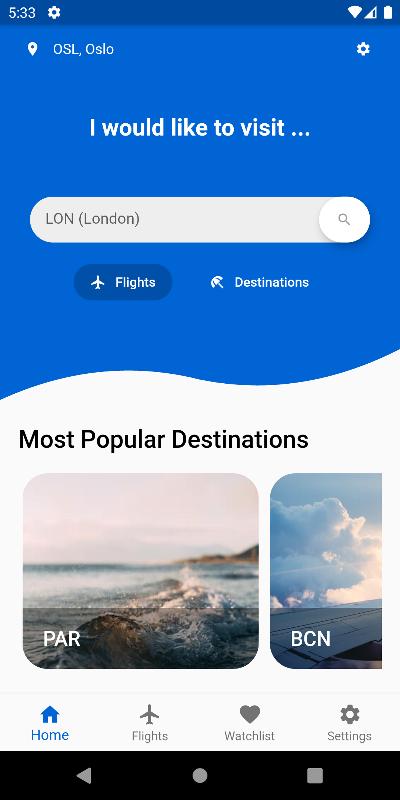
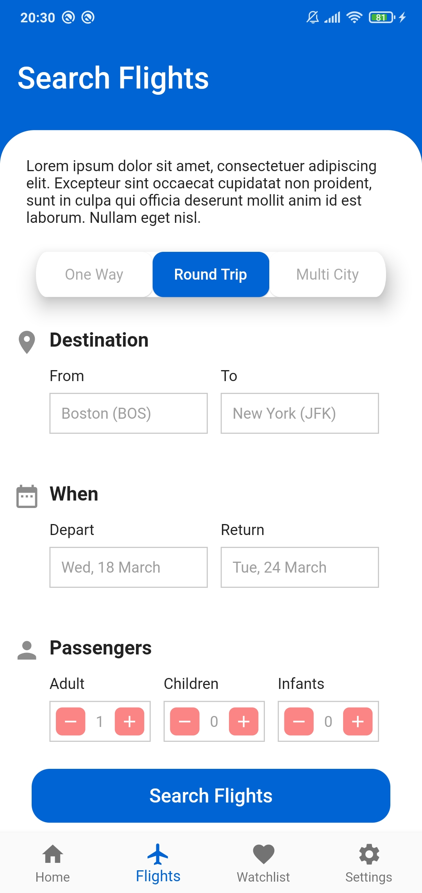
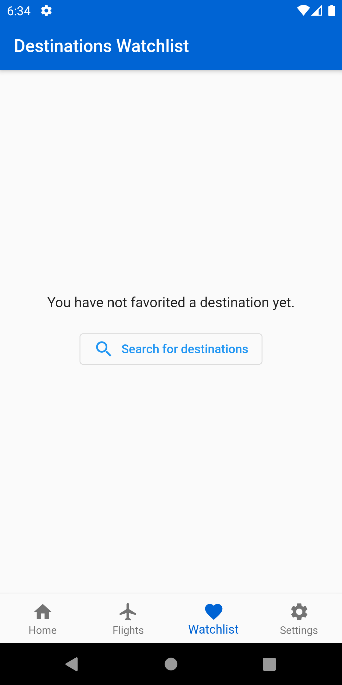
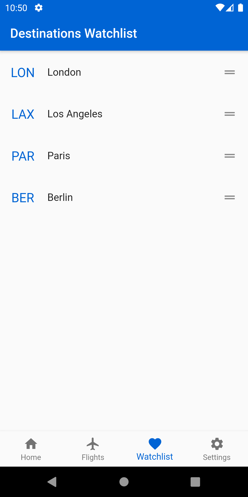
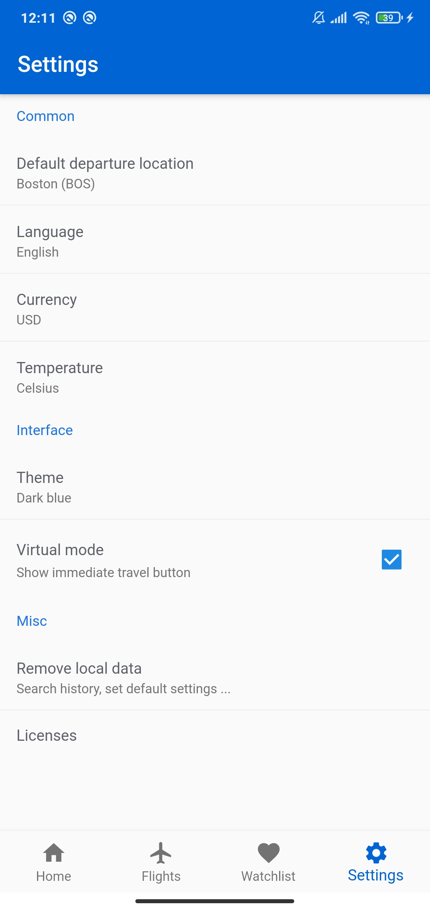

```
 			                    -- Virtual Traveller --
				                      WIP
	  APP IS IN THE VERY EARLY DEVELOPMENT PROGRESS - AND DOESN'T REPRESENT THE FINAL STATE
```

# Virtual Traveller
&nbsp;&nbsp;&nbsp;&nbsp; [](https://codecov.io/gh/mzdm/virtual_traveller_flutter)

Search for flights and deep dive into large offers of travelling destinations. Discover recommended and popular places. Hop on on the virtual mode to simulate travelling immediately to your desired destination and learn more about it, including interesting information and points of interests! 🚀

## Index
- [Previews](https://github.com/mzdm/virtual_traveller_flutter#previews)
- [How to run](https://github.com/mzdm/virtual_traveller_flutter#how-to-run)
- [Idea](https://github.com/mzdm/virtual_traveller_flutter#idea)
- [Visualizing the flow of the app](https://github.com/mzdm/virtual_traveller_flutter#visualizing-the-flow-of-the-app)
- [State management](https://github.com/mzdm/virtual_traveller_flutter#state-management)
- [App Architecture](https://github.com/mzdm/virtual_traveller_flutter#app-architecture)
- [TO:DO list](https://github.com/mzdm/virtual_traveller_flutter#todo-list)
- [Dependencies](https://github.com/mzdm/virtual_traveller_flutter#dependencies)
- [UI inspirations](https://github.com/mzdm/virtual_traveller_flutter#ui-inspirations)
- [Related recommended resources](https://github.com/mzdm/virtual_traveller_flutter#related-recommended-resources)
- [Contribution](https://github.com/mzdm/virtual_traveller_flutter#contribution)

## Previews
<p align="left">

</p>
<p align="left">

</p>
<p align="left">


</p>
<p align="left">

</p>

## How to run
\-

## Idea
I wanted to make a flight searching app with interesting suggestions, fully from the scratch. However, due to the current situation with the pandemic, many countries are restricted for some citizens so travelling there isn't possible. This app has virtual travelling mode, which simulates the travelling here, displays interesting information about the desired location, including picture, points of interests and etc. There's a possibility to save the locations, so you can check them out later!

Powered by the [Amadeus for Developers API](https://developers.amadeus.com/), which fits best for this use and offers also free monthly quota for testing! Amadeus Travel APIs connect you to the richest information in the travel industry.

## Visualizing the flow of the app


## App Architecture
Using the bloc library allows us to separate our application into three layers:

- Presentation
- Business Logic
- Data
  - Repository
  - Data Provider
  - Models

<p align="center">

</p>

<p align="center">

</p>

## State management 
There's no unique rule on what to choose because it always depends on many criteria. When it came to deciding on which state management approach to use in my case, I was deciding between Provider and bloc library. Bloc library is already dependant on Provider package so it is fairly similar in terms of a dependency injection (DI) (a single instance of a Cubit or Bloc can be provided to all of the widgets within a subtree). [Read more here about bloc library](https://bloclibrary.dev/#/) and [Provider](https://pub.dev/packages/provider).

The reasons why I decided to use the bloc library in my case were following:
- use of the reactive streams, which goes well together with BLoC pattern
- easy and reliable tests via bloc_test library, which is based on Mockito
- it isn't only a state management library, but it also helps implement the BLoC (Business Logic Component) design pattern

## TO:DO list
### Basics:
- [ ] Features
  - [ ] Splash screen
  - [ ] Intro slider on the first app launch
  - [ ] Home Page Features
    - [ ] Change departure location
    - [ ] Quick search
        - [ ] One-Way flights
        - [ ] Destinations
    - [ ] Discover most popular / booked travelling destinations based on current location
    - [ ] Recommended destinations based on search history
  - [ ] Flight Searching Page Features
    - [ ] View search history
    - [ ] Search by
      - [ ] Type of the way
        - [ ] One-Way
        - [ ] Round Trip
        - [ ] Multi City
      - [ ] Dates
        - [ ] Departure
        - [ ] Return
      - [ ] Passengers
        - [ ] Adults
        - [ ] Kids
        - [ ] Infants
  - [ ] Flight Result Page Features
      - [ ] Switch departure and destination in the search
      - [ ] Display quick search query info details
      - [ ] View more about the destination
      - [ ] Sort by
        - [ ] Price
        - [ ] Length
        - [ ] Number of stops
      - [ ] Flight offer details
        - [ ] From - To
        - [ ] Departure - Arrival date
        - [ ] Flight length
        - [ ] Flight stops
        - [ ] Passengers
        - [ ] Price
        - [ ] Airplane type
      - [ ] Virtual Flight Mode
        - [ ] Simulate plane flying on the map with timestamps
  - [ ] Destination Page Features
      - [ ] Save destination to the Watchlist
      - [ ] Pictures
      - [ ] Average temperature of the past week
      - [ ] Safety Rating
      - [ ] Points of Interests
      - [ ] Hotels
  - [ ] Watchlist Page
    - [ ] Click to view the info about the destination
    - [ ] Drag to reorder destinations
    - [ ] Swipe to remove
  - [ ] Settings Page
    - [ ] Default departure location
    - [ ] Language
    - [ ] Currency
    - [ ] Temperature format
    - [ ] Length unit
    - [ ] Theme
    - [ ] Remove local data
- [ ] Language Support
  - [x] English
  - [x] Czech
  - [ ] Portuguese
  - [ ] French
  - [ ] German
  - [ ] Russian
- [ ] Supported Platforms
  - [x] Android
  - [x] iOS
  - [x] Web
  - [ ] Desktop (Windows)

### Other:
- [ ] ~~Null safety~~ (not possible yet - not all packages are yet migrated)
- [x] CI / Github Actions
- [ ] Type of tests
  - [x] Unit
  - [ ] Widget
  - [ ] Integration
- [ ] Test coverage milestones
  - [ ] 40%
  - [ ] 60%
  - [ ] 80%

## Dependencies:
- #### Common packages:
    - [pedantic](https://pub.dev/packages/pedantic)
    - [equatable](https://pub.dev/packages/equatable)
    - [flutter_bloc](https://pub.dev/packages/flutter_bloc)
    - [bloc_test](https://pub.dev/packages/bloc_test)
    - [mockito](https://pub.dev/packages/mockito)
    - [http](https://pub.dev/packages/http)
    - [rx_dart](https://pub.dev/packages/rxdart)
    - [freezed](https://pub.dev/packages/freezed)
    - [build_runner](https://pub.dev/packages/build_runner)
    - [json_serializable](https://pub.dev/packages/json_serializable)
    - [shared_preferences](https://pub.dev/packages/shared_preferences)
    - [geolocator](https://pub.dev/packages/geolocator)

- #### UI packages:
    - [clean_settings](https://pub.dev/packages/clean_settings)
    - [flutter_typeahead](https://pub.dev/packages/flutter_typeahead)

## UI inspirations
- [Material Design - Crane Travel App](https://material.io/design/material-studies/crane.html)
- [Search Flights - Mobile Booking App UI Design by Nitish Khagwal](https://dribbble.com/shots/10749939-Search-Flights-Mobile-Booking-App-UI-Design)
- [Flight Tickets Deal Tracker App | Day 340/365 - Project365 by Kishore](https://dribbble.com/shots/5662956-Flight-Tickets-Deal-Tracker-App-Day-340-365-Project365)

## Related recommended resources
- [Amadeus for Developers API Overview](https://github.com/amadeus4dev/hackathon-starter/blob/master/cheatsheets/amadeus4dev.pdf)
- [Amadeus Self-Service API](https://developers.amadeus.com/self-service)
- [Great YouTube channel about the BLoC Architecture](https://www.youtube.com/channel/UC5PYcSe3to4mtm3SPCUmjvw)
- [bloc library docs](https://bloclibrary.dev/#/)
- [Freezed ❄ – Data Class & Union in One Dart Package - by Reso Coder](https://resocoder.com/2020/02/11/freezed-data-class-union-in-one-dart-package/#t-1600693077177)
- [Flutter Internationalization User Guide](http://flutter.dev/go/i18n-user-guide)

## Contribution
The app is still in the development process and isn't suitable for contributions yet.

~~If you wish to contribute, file an issue with an appropriate tag or propose a PR. If it is a breaking change, please create an issue first.~~
